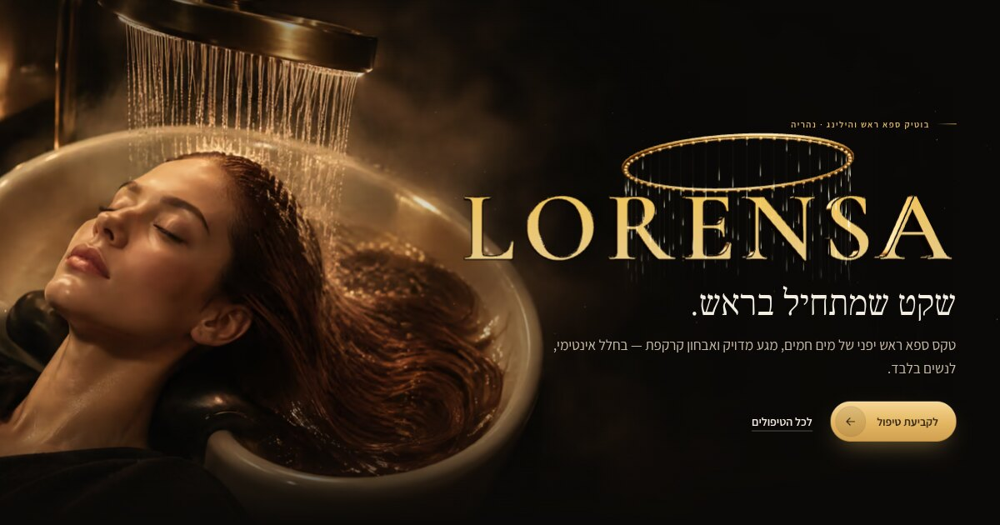

# LORENSA — בוטיק ספא ראש והילינג

אתר תדמית בעברית (RTL) ללורנסה: לוגו זהב תלת־ממדי בזמן אמת (WebGL), גלילה חלקה,
פסי לד צדדיים, ואנימציות מדויקות. נבנה ב־Vite + three.js + GSAP + Lenis, ללא פריימוורק כבד.



## עריכת פרטי העסק

כל פרטי הקשר נמצאים בקובץ **`.env`** ונכנסים לאתר בזמן הבנייה:

| משתנה | מה זה |
|---|---|
| `VITE_PHONE_DISPLAY` | הטלפון כפי שיוצג באתר |
| `VITE_PHONE_E164` | הטלפון לחיוג, בפורמט ‎+972…‎ |
| `VITE_WHATSAPP` | מספר וואטסאפ בפורמט בינלאומי בלי + (למשל `972501234567`) |
| `VITE_INSTAGRAM` | קישור לאינסטגרם |
| `VITE_CITY` | עיר / כתובת |
| `VITE_SITE_URL` | כתובת האתר הסופית (לשיתוף ברשתות ולגוגל) |

> **שימו לב:** כרגע מוגדרים מספרי דמה (`00-000-0000`). חובה להחליף לפני העלאה לאוויר.

הטקסטים (טיפולים, משכי זמן, שאלות נפוצות) נמצאים ישירות ב־`index.html`.

## הרצה

```bash
npm install
npm run dev       # שרת פיתוח
npm run build     # בנייה לתיקיית dist/
npm run preview   # תצוגה של הבנייה
```

התיקייה `dist/` היא אתר סטטי מלא ומתאימה לכל אחסון (Vercel, Netlify, GitHub Pages, cPanel).
ההגדרה `base: './'` מאפשרת להעלות אותה גם לתת־תיקייה.

## Project map (English)

```
index.html                  All content and semantic markup (Hebrew, RTL)
src/main.js                 Entry: fonts, styles, module bootstrapping
src/styles/                 tokens · base · components · sections (logical properties only)
src/modules/                motion (Lenis + GSAP), nav, reveal, leds, manifesto scrub,
                            services picker, ritual halo, space parallax, magnetic, tilt,
                            accordion, media fallbacks, hero orchestration
src/scene/hero-scene.js     The 3D wordmark scene (lazy-loaded three.js chunk)
src/scene/wordmark.typeface.json   Glyphs for LORENSA (generated)
scripts/build-wordmark.mjs  Regenerates the typeface JSON from Cormorant Garamond
scripts/fetch-images.mjs    Downloads source photos → responsive AVIF/WebP in public/images
.github/workflows/images.yml  Runs the image pipeline in CI and commits the renditions
DESIGN.md                   The design system: palette, type, components, motion, bans
```

### Images

Photography lives in `public/images/{name}-{width}.{avif,webp}`. To change a photo, update its
source in `scripts/image-sources.json` (a URL or a local `file`) and run `npm run images -- --force`,
or push the change and let the **Optimize images** workflow regenerate and commit the renditions.

### The 3D hero

- Glyphs come from Cormorant Garamond 600, extruded with a bevel and tinted top→bottom like the
  printed logo, in brushed PBR gold.
- The environment is a dark studio lit by warm "LED" strips and a graded front scrim.
- The halo ring, nozzles and water threads are custom shaders.
- The scene fits itself to the DOM slot `.hero__mark`, so layout stays in CSS.
- A gold DOM wordmark paints instantly and cross-fades into the 3D one. It is also the fallback when
  WebGL is unavailable, on Save-Data, and the static frame for `prefers-reduced-motion`.
- The render loop runs only while the hero is visible. A quality governor lowers the pixel ratio,
  and then freezes ambient motion, on slow GPUs.
